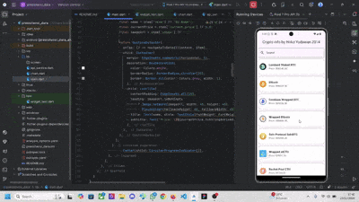

# presistensi_dara

A new Flutter project.

diatas merupakan hasil akhir dari tugas ini
disini saya menggunakan API dari Coin Gecko (https://api.coingecko.com/api/v3/coins/markets?vs_currency=usd)
Kode menggunakan API coin gecko untuk mengambil data pasar cryptocurrency. API ini memberikan informasi tentang berbagai cryptocurrency termasuk harga saat ini, nama, dan gambar.
kemudia membuat kelas ApiService, Kelas ApiService bertanggung jawab untuk mengambil data dari API dengan Menggunakan http untuk melakukan permintaan GET ke endpoint coin gecko.
Data cryptocurrency yang diambil diurutkan berdasarkan harga tertinggi dan disimpan dalam filteredCryptocurrencies. Pengguna dapat mencari cryptocurrency menggunakan TextField, yang memfilter daftar berdasarkan nama cryptocurrency. Daftar cryptocurrency ditampilkan menggunakan ListView, di mana setiap item dapat diketuk untuk menampilkan detail lebih lanjut.

Ketika pengguna klik item dalam daftar, aplikasi akan menavigasi ke DetailScreen, yang menampilkan informasi lebih lanjut tentang cryptocurrency termasuk grafik harga. Grafik harga ditampilkan menggunakan widget Chart yang menggunakan fl_chart untuk menggambarkan data harga dalam bentuk grafik garis.

## Getting Started

This project is a starting point for a Flutter application.

A few resources to get you started if this is your first Flutter project:

- [Lab: Write your first Flutter app](https://docs.flutter.dev/get-started/codelab)
- [Cookbook: Useful Flutter samples](https://docs.flutter.dev/cookbook)

For help getting started with Flutter development, view the
[online documentation](https://docs.flutter.dev/), which offers tutorials,
samples, guidance on mobile development, and a full API reference.
